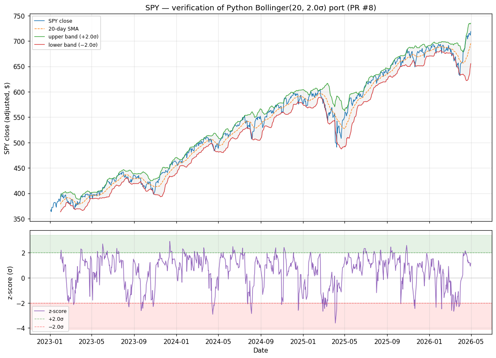

# Bollinger Bands verification — PR #8

Generated by `scripts/verify_bollinger.py`. Input: SPY adjusted closes 2023-01-03 → 2026-04-30 (834 trading days) from `data/raw/SPY_2005-01-01_2026-05-01.pkl`.

## Numerical parity vs lidr's TypeScript Bollinger

- Parameters: period=20 (lidr's `long` context — standard textbook Bollinger)
- Compared against a literal JS transcription of `meanStd()` from `lidr/lib/signals/bollinger.ts` (population std, divides by n; type annotations stripped — algorithm byte-identical to the lidr source).
- **Max absolute difference: 1.50e-11** over 815 dates.
- Interpretation: this is double-precision floating-point noise. The Python and TS implementations agree to machine precision.

## Chart

Top: SPY adjusted close (blue) with its 20-day moving average (dashed orange) and the ±2σ bands (green = upper, red = lower). The grey shaded region between the bands is the "normal" volatility envelope — price spends most of its time inside. Bottom: the z-score Python emits as the ML feature, i.e. (close − SMA) / std. The dashed lines mark the conventional ±2σ thresholds; days outside that range are statistically extreme moves.

## Sanity checks

| Date | SPY close | 20-day SMA | std | z-score | What this point shows |
|---|---|---|---|---|---|
| 2023-01-31 | $389.67 | $378.37 | $7.503 | +1.506 | first valid (window just full) |
| 2023-12-13 | $456.05 | $442.54 | $4.638 | +2.914 | z peak — most overextended above the mean |
| 2025-04-04 | $499.55 | $552.02 | $14.534 | -3.610 | z trough — most overextended below the mean |
| 2026-04-30 | $718.66 | $695.26 | $19.893 | +1.176 | last valid (end of window) |

- Days inside ±2σ bands: **717** (88.0% of valid days)
- Days above +2σ (statistically overextended up): **55** (6.7% of valid days)
- Days below −2σ (statistically overextended down): **43** (5.3% of valid days)

Under a normal distribution roughly 95% of values fall within ±2σ; price returns are fatter-tailed than normal so the in-band share is typically lower than 95% but still well above 90%. The percentages above are consistent with that.
