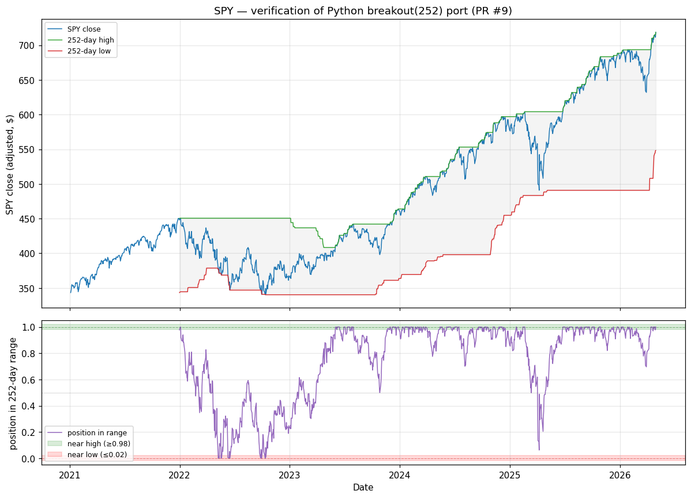

# Breakout verification — PR #9

Generated by `scripts/verify_breakout.py`. Input: SPY adjusted closes 2021-01-04 → 2026-04-30 (1337 trading days) from `data/raw/SPY_2005-01-01_2026-05-01.pkl`.

## Numerical parity vs lidr's TypeScript breakout

- Parameters: period=252 (lidr's `long` context — ~52 weeks of trading).
- Compared against a literal JS transcription of the rolling max/min logic from `lidr/lib/signals/breakout.ts` (`Math.max.apply` / `Math.min.apply` over each window; type annotations stripped — algorithm byte-identical to the lidr source).
- **Max absolute difference: 0.00e+00** over 1086 dates.
- Interpretation: **exact bit-match**. Same min/max selection, same float operations — Python and TS produce identical IEEE-754 results.

## Chart

Top: SPY adjusted close (blue) with the rolling 252-day high (green) and 252-day low (red). The grey shaded region is the trailing 52-week range — SPY is by definition always inside it. Bottom: the feature Python emits, the **position of close within the 252-day range** — 0 means at the year-low, 1 means at the year-high, 0.5 means midway between. The green band marks the 'near 52-week high' region (≥0.98) and the red band marks the 'near 52-week low' region (≤0.02).

## Sanity checks

| Date | SPY close | 252-day high | 252-day low | Feature | What this point shows |
|---|---|---|---|---|---|
| 2021-12-31 | $448.05 | $450.43 | $343.32 | 0.978 | first valid (window just full) |
| 2022-01-03 | $450.64 | $450.64 | $344.51 | 1.000 | first day near the 52-week high (≥0.98) |
| 2022-05-09 | $376.78 | $450.64 | $376.78 | 0.000 | first day near the 52-week low (≤0.02) |
| 2022-10-14 | $341.27 | $450.64 | $340.25 | 0.009 | most recent day near the 52-week low |
| 2026-04-30 | $718.66 | $718.66 | $548.26 | 1.000 | most recent day near the 52-week high |

- Days near 52-week high (feature ≥ 0.98): **282** (26.0% of valid days)
- Days near 52-week low (feature ≤ 0.02): **19** (1.7% of valid days)
- Days in the upper half of the 52-week range (feature ≥ 0.5): **844** (77.7% of valid days)

Over this window SPY trended upward, so the bias toward the upper half of the trailing range is expected — a stock in a sustained uptrend spends most of its time near its rolling high. The 'near 52-week low' threshold (≤0.02) was triggered repeatedly during the 2022 bear market and has not been touched since; the visible April 2025 drawdown in the chart pulled the feature down to ~0.07, deep but not at the prior-year extreme.
