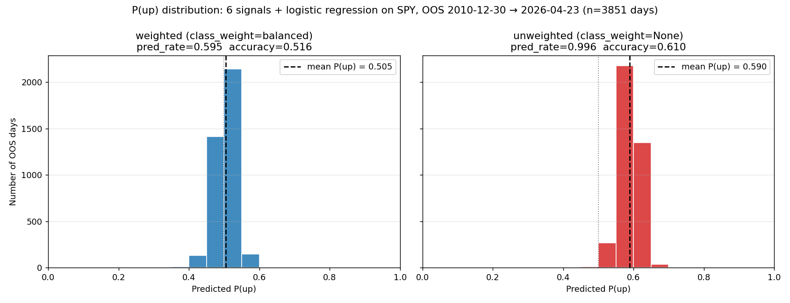

# class_weight=None sanity check

**Question:** is the negative-skill verdict from `baseline_six_signals`
real, or a `class_weight=balanced` artifact distorting `predict_proba`?
(See Gotchas in CLAUDE.md re: balanced reweighting and calibration.)

**Answer:** the Gotcha was understated — `class_weight=balanced` was
costing **0.033 of skill_score** (-0.0374 → -0.0051, ~7× shrinkage in
distance from no-skill baseline). But removing it **does not** make the
model skillful. It moves the model from *anti-informative* (confidently
wrong) to *no-skill baseline* (predicts the base rate every day, ≈always
long). The features still don't carry signal; the linear model still
can't extract any. LightGBM remains the right next step — recommendation
unchanged, conviction stronger.

## What changed when class_weight was removed

Single new config (`configs/baseline_six_signals_unweighted.yaml`),
identical to `baseline_six_signals.yaml` except `class_weight` is omitted
(sklearn default = `None`).

| Metric | weighted | unweighted | Δ |
|---|---|---|---|
| `skill_score` | -0.0374 | **-0.0051** | +0.033 |
| `log_loss` | 0.6934 | 0.6717 | -0.022 |
| `accuracy` | 0.516 | **0.610** | +0.094 |
| `pred_rate` | 0.595 | **0.996** | +0.401 |
| `mean P(up)` | 0.505 | 0.590 | +0.085 |
| strategy CAGR | 6.07% | **14.25%** | +8.18 pp |
| benchmark CAGR | 13.98% | 14.04% | +0.06 pp |
| strategy Sharpe | 0.58 | **0.90** | +0.32 |
| strategy max DD | -22.9% | -26.7% | -3.8 pp (deeper) |
| strategy final equity | 2.47× | **7.65×** | +5.18× |
| excess CAGR vs B&H | -7.91% | **+0.20%** | +8.11 pp |

The strategy metrics all look dramatic, but **they're mechanical**: when
the model is long 99.6% of days, the strategy is essentially the
underlying minus tiny transaction costs. `+0.20%` excess CAGR isn't
edge — it's the rounding error between "always long" and "buy and
hold."

## Why this is not skill

The P(up) distributions tell the real story:



Both distributions are **narrow spikes**, ~0.10 wide. The unweighted
distribution is just shifted ~0.09 to the right. Neither model is using
the features to make *different-sized predictions on different days*;
both are essentially constant predictors with slightly different
constants. The unweighted model has:

- `mean P(up) = 0.590` ≈ `base_rate = 0.611` — the model has learned
  the unconditional class frequency and outputs it ~constantly.
- 99.6% of P(up) above 0.5 — virtually every day is a "long" decision.
- Range [0.40, 0.70] — almost nothing outside this band. A model that
  actually used its features should produce values like 0.2 (clearly
  bearish day) and 0.8 (clearly bullish day) when the signals align.

This pattern — accuracy ≈ base_rate, pred_rate ≈ 1.0 — is exactly what
"always predict the majority class" gives you. `skill_score ≈ 0` because
the no-skill baseline is *also* "always predict the base rate." That's
the same model.

The improvement from `-0.0374` to `-0.0051` is real: it confirms
`class_weight=balanced` was *actively making the model worse* than the
trivial constant-base-rate predictor (by forcing confidently-wrong
predictions on a 60/40 problem). Removing it brings the model up to the
trivial baseline. Neither version actually beats the no-skill floor.

## What this means for next steps

1. **`class_weight=balanced` is empirically harmful for this dataset.**
   The Gotcha bullet ("distorts `predict_proba`") was descriptively
   correct but understated the cost. Updated in CLAUDE.md Gotchas.
2. **Both six-signal logistic models lack discriminating power.** The
   features-via-linear-model setup can't extract day-to-day variation
   in P(up). The next move (LightGBM) targets exactly this constraint —
   trees can produce values like 0.25 or 0.78 in response to feature
   interactions a linear+scaled model can't represent.
3. **Calibration is still needed before any artifact ships to lidr.**
   The unweighted model technically has `mean P(up) ≈ base_rate`, which
   is *aggregate* calibration, but predicting "59%" on every single
   day is useless to lidr — the website needs day-to-day variation,
   which neither model provides. Calibration via Platt/isotonic (Next
   Up: calibration) is a downstream concern; first the model needs to
   produce variable probabilities at all.

## Reproduction

```bash
make backtest CONFIG=configs/baseline_six_signals_unweighted.yaml
make backtest CONFIG=configs/baseline_six_signals.yaml  # for the comparison row
python scripts/verify_classweight_sanity_check.py
```

Sources:
- `artifacts/predictions/baseline_six_signals-20260527-135054.json` (post-dup-fix re-run; same skill_score as the pre-fix row, confirming the dup-fix is benign on this metric)
- `artifacts/predictions/baseline_six_signals_unweighted-20260527-134952.json`
- `artifacts/results_log.csv` (rows `20260527-134952` and `20260527-135054`)
