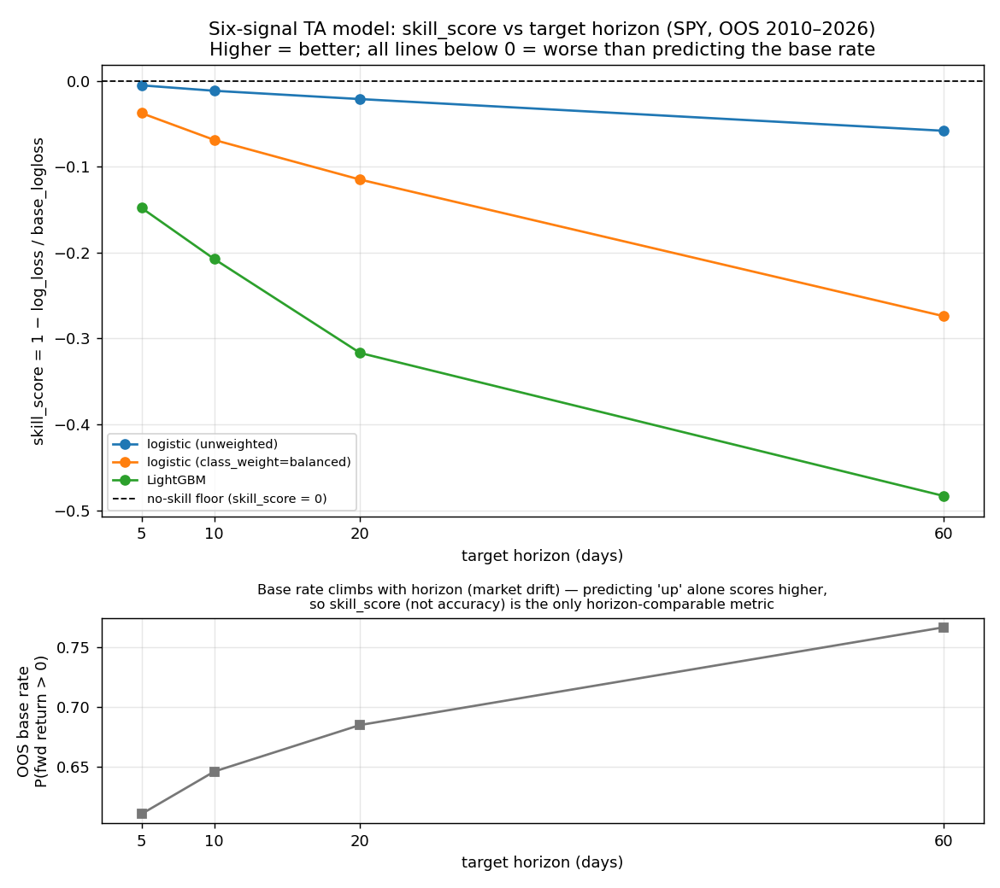

# Horizon spike — verification evidence

Generated by `scripts/verify_horizon_sweep.py` from the 12 prediction artifacts under `artifacts/predictions/ta_ensemble/`. Every number below is recomputed from the artifacts' `y_true` / `probability_up`, not copied from the pipeline's logged output, and cross-checked against `results_log.csv`.

## Sweep results (SPY, OOS 2010-12 → 2026-04)

`skill_score` is the headline metric: 1 − log_loss/base_logloss, where the floor is the entropy of each horizon's *own* base rate. 0 = no skill; negative = worse than predicting the base rate every day.

| model | horizon | base_rate | accuracy | pred_rate | skill_score | log_loss | base_logloss | n_oos | strat_cagr | bench_cagr |
|---|---|---|---|---|---|---|---|---|---|---|
| logistic (unweighted) | 5 | 0.611 | 0.610 | 0.996 | -0.0051 | 0.6717 | 0.6683 | 3851 | +0.1425 | +0.1404 |
| logistic (unweighted) | 10 | 0.646 | 0.643 | 0.989 | -0.0114 | 0.6571 | 0.6497 | 3846 | +0.1292 | +0.1402 |
| logistic (unweighted) | 20 | 0.685 | 0.685 | 1.000 | -0.0211 | 0.6361 | 0.6230 | 3836 | +0.1312 | +0.1347 |
| logistic (unweighted) | 60 | 0.766 | 0.760 | 0.994 | -0.0580 | 0.5752 | 0.5437 | 3796 | +0.1416 | +0.1394 |
| logistic (class_weight=balanced) | 5 | 0.611 | 0.516 | 0.595 | -0.0374 | 0.6933 | 0.6683 | 3851 | +0.0613 | +0.1404 |
| logistic (class_weight=balanced) | 10 | 0.646 | 0.525 | 0.653 | -0.0687 | 0.6943 | 0.6497 | 3846 | +0.0178 | +0.1402 |
| logistic (class_weight=balanced) | 20 | 0.685 | 0.521 | 0.672 | -0.1149 | 0.6945 | 0.6230 | 3836 | +0.0480 | +0.1347 |
| logistic (class_weight=balanced) | 60 | 0.766 | 0.540 | 0.671 | -0.2739 | 0.6926 | 0.5437 | 3796 | +0.0452 | +0.1394 |
| LightGBM | 5 | 0.611 | 0.538 | 0.676 | -0.1478 | 0.7671 | 0.6683 | 3851 | +0.0928 | +0.1404 |
| LightGBM | 10 | 0.646 | 0.579 | 0.701 | -0.2075 | 0.7845 | 0.6497 | 3846 | +0.0870 | +0.1402 |
| LightGBM | 20 | 0.685 | 0.600 | 0.740 | -0.3169 | 0.8204 | 0.6230 | 3836 | +0.0861 | +0.1347 |
| LightGBM | 60 | 0.766 | 0.641 | 0.767 | -0.4833 | 0.8064 | 0.5437 | 3796 | +0.0906 | +0.1394 |

## Per-year strategy vs buy-and-hold — logistic h5 vs h60

The equity curve marks every position to market on **1-day-forward returns** regardless of the classification horizon (`pipeline.py`), so strategy CAGR is **not** a tradeable-at-that-horizon number — it is informational. At h60 the model predicts 'up' on ~all days (high base rate), so the strategy ≈ buy-and-hold; any excess is exposure, not skill.

### logistic, horizon 5 (pred_rate 0.996)

| year | n | buy_hold_return | strategy_return | excess |
|---|---|---|---|---|
| 2010 | 2 | +0.0106 | +0.0101 | -0.0005 |
| 2011 | 252 | +0.0246 | +0.0395 | +0.0149 |
| 2012 | 250 | +0.1710 | +0.1710 | +0.0000 |
| 2013 | 252 | +0.2777 | +0.2777 | +0.0000 |
| 2014 | 252 | +0.1450 | +0.1450 | +0.0000 |
| 2015 | 252 | -0.0013 | -0.0013 | +0.0000 |
| 2016 | 252 | +0.1445 | +0.1445 | +0.0000 |
| 2017 | 251 | +0.2165 | +0.2165 | +0.0000 |
| 2018 | 251 | -0.0515 | -0.0515 | +0.0000 |
| 2019 | 252 | +0.3231 | +0.3231 | +0.0000 |
| 2020 | 253 | +0.1564 | +0.1719 | +0.0155 |
| 2021 | 252 | +0.3126 | +0.3126 | +0.0000 |
| 2022 | 251 | -0.1899 | -0.1899 | +0.0000 |
| 2023 | 250 | +0.2600 | +0.2600 | +0.0000 |
| 2024 | 252 | +0.2528 | +0.2528 | +0.0000 |
| 2025 | 250 | +0.1823 | +0.1823 | +0.0000 |
| 2026 | 77 | +0.0479 | +0.0479 | +0.0000 |

### logistic, horizon 60 (pred_rate 0.994)

| year | n | buy_hold_return | strategy_return | excess |
|---|---|---|---|---|
| 2010 | 2 | +0.0106 | +0.0101 | -0.0005 |
| 2011 | 252 | +0.0246 | +0.0581 | +0.0335 |
| 2012 | 250 | +0.1710 | +0.1685 | -0.0024 |
| 2013 | 252 | +0.2777 | +0.2777 | +0.0000 |
| 2014 | 252 | +0.1450 | +0.1450 | +0.0000 |
| 2015 | 252 | -0.0013 | -0.0013 | +0.0000 |
| 2016 | 252 | +0.1445 | +0.1445 | +0.0000 |
| 2017 | 251 | +0.2165 | +0.2165 | +0.0000 |
| 2018 | 251 | -0.0515 | -0.0515 | +0.0000 |
| 2019 | 252 | +0.3231 | +0.3231 | +0.0000 |
| 2020 | 253 | +0.1564 | +0.1564 | +0.0000 |
| 2021 | 252 | +0.3126 | +0.3126 | +0.0000 |
| 2022 | 251 | -0.1899 | -0.1899 | +0.0000 |
| 2023 | 250 | +0.2600 | +0.2600 | +0.0000 |
| 2024 | 252 | +0.2528 | +0.2528 | +0.0000 |
| 2025 | 250 | +0.1823 | +0.1823 | +0.0000 |
| 2026 | 22 | +0.0044 | +0.0044 | +0.0000 |

## Gut checks

- ✅ PASS — Parity anchor (h5 reproduces committed results_log rows: logistic −0.005104, weighted −0.037443, lightgbm −0.147833)
- ✅ PASS — Chart-vs-log (skill_score recomputed from artifacts == logged value, |Δ| < 5e-4)
- ✅ PASS — n_oos (artifact prediction count == logged n_oos for all 12)
- ✅ PASS — base_rate reported beside accuracy in the table above (drift 0.60→0.73 visible)
