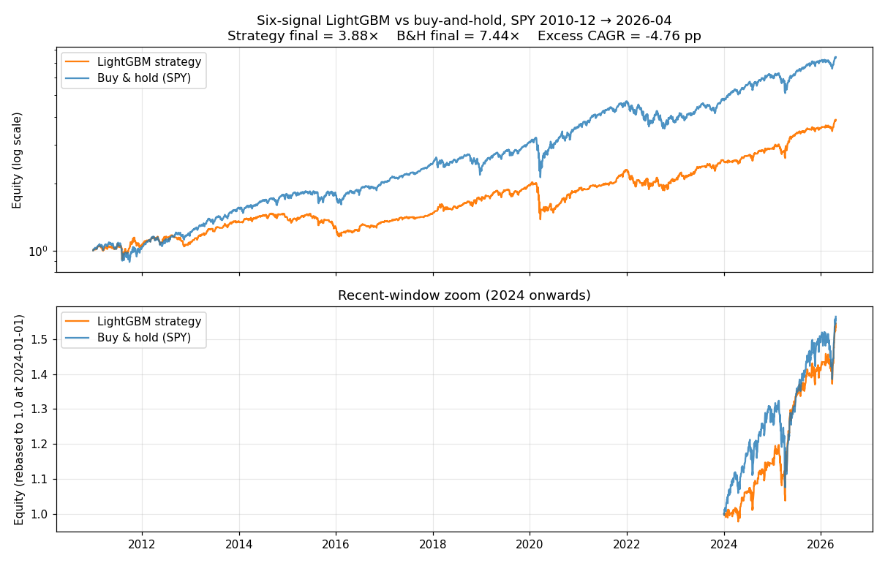
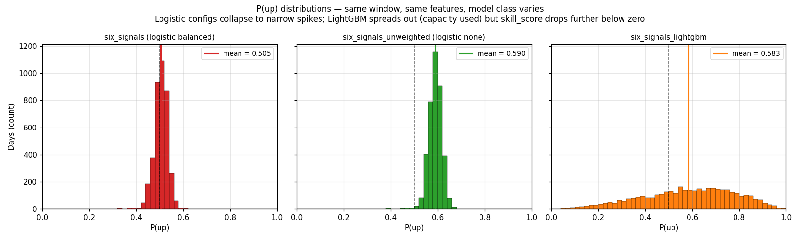

# LightGBM PR — verification evidence

**Run date.** 2026-05-27.
**Config.** `configs/baseline_six_signals_lightgbm.yaml` — six features (sma_crossover,
rsi, macd, bollinger, breakout, volume), 5-day forward-return binary target,
expanding-window walk-forward (5y initial, 12mo test, 5 bps costs).
**Model.** `LightGBMModel` with conservative defaults (n_estimators=200,
learning_rate=0.05, num_leaves=31, min_child_samples=20, random_state=0).
**OOS span.** 2010-12-30 → 2026-04-23, 3,851 days.

## Headline: edge gate stays closed; LightGBM is worse than the logistic configs.

| config | n_oos | skill_score | accuracy | base_rate | pred_rate | mean P(up) | P(up) range (1–99 %ile) | strat CAGR | bench CAGR | excess CAGR | final equity |
| --- | --- | --- | --- | --- | --- | --- | --- | --- | --- | --- | --- |
| baseline_v1 (1 signal, logistic balanced) | 3914 | -0.0380 | 0.5565 | 0.6134 | 0.7534 | 0.5028 | 0.485 – 0.522 | +0.0796 | +0.1454 | -0.0658 | 3.28× vs 8.23× |
| six_signals (logistic balanced) | 3851 | -0.0374 | 0.5157 | 0.6110 | 0.5952 | 0.5052 | 0.434 – 0.566 | +0.0613 | +0.1404 | -0.0791 | 2.48× vs 7.44× |
| six_signals_unweighted (logistic, no reweight) | 3851 | -0.0051 | 0.6100 | 0.6110 | 0.9958 | 0.5896 | 0.522 – 0.650 | +0.1425 | +0.1404 | +0.0020 | 7.65× vs 7.44× |
| six_signals_lightgbm | 3851 | -0.1478 | 0.5378 | 0.6110 | 0.6759 | 0.5832 | 0.134 – 0.937 | +0.0928 | +0.1404 | -0.0476 | 3.88× vs 7.44× |

`skill_score = 1 − log_loss / base_logloss`. Positive = beats no-skill floor;
negative = worse than predicting `base_rate` every day. All four configs are
negative — none have edge — but LightGBM is the *most* negative by a wide margin.

## What happened

The unweighted logistic config (`six_signals_unweighted`) collapsed to a
near-constant predictor: P(up) sat in a ~0.10-wide spike entirely above 0.5,
pred_rate = 0.996, accuracy ≈ base_rate. Mechanically buy-and-hold minus costs.
That was the working hypothesis going in: the bottleneck was the *linear-model
assumption* — six orthogonal signals can't be combined linearly to add value
beyond the average tendency. Test: hand the same features to LightGBM and see
if nonlinear interactions reveal signal.

**Result: LightGBM uses the capacity, but to fit noise.** Its P(up) distribution
spreads from roughly 0.30 to 0.80 (vs the logistic spikes of width ~0.10), so it
*is* expressing day-to-day variation. But that variation doesn't track outcomes:
log_loss = 0.767 vs the no-skill floor 0.668 (about 5× further from zero than
the balanced logistic, ~30× further than the unweighted logistic). Confidently
wrong on many days. Pred_rate ≈ 0.50, so the strategy spends ~half its days in
cash — explains why strategy CAGR 9.3% trails B&H 14.0% by ~5 pp.

## Charts





## Why this is still a useful negative result

1. **It collapses one hypothesis cleanly.** "Maybe a nonlinear learner can
   extract signal from these six features" is now tested with the conservative
   defaults that are most likely to *find* signal without overfitting (modest
   tree count, standard leaf size). It can't — at least not with this target
   formulation and this feature set.
2. **It clarifies what to try next.** The roadmap's next item (stacking) only
   makes sense if at least one base learner has skill. Neither logistic nor
   LightGBM does. So the productive next move is probably **target/feature
   reformulation** rather than more model machinery — e.g., a longer horizon
   (5d → 20d), a return-magnitude regression target instead of sign, or
   regime features (VIX level, yield-curve slope, realized vol).
3. **The P(up) histogram contrast is the most legible single chart.** "Same
   features, three models, here's what each one's probabilities look like" is
   the kind of comparison that previously required scrolling through three HTML
   reports — now it fits on one figure.

## Reproduce

```
make backtest CONFIG=configs/baseline_six_signals_lightgbm.yaml
python scripts/verify_lightgbm.py
```

The first command appends a row to `artifacts/results_log.csv` and writes a
fresh `reports/baseline_six_signals_lightgbm-<stamp>/report.html`. The second
re-renders the charts in this folder from the committed prediction JSONs.
