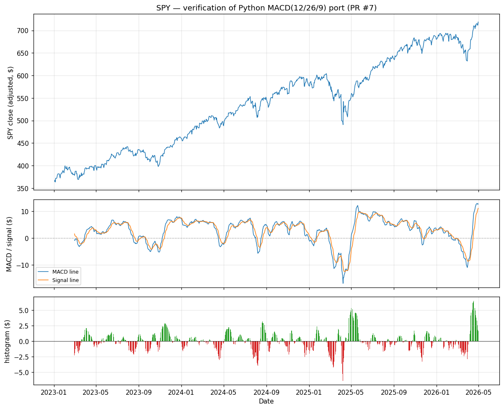

# MACD verification — PR #7

Generated by `scripts/verify_macd.py`. Input: SPY adjusted closes 2023-01-03 → 2026-04-30 (834 trading days) from `data/raw/SPY_2005-01-01_2026-05-01.pkl`.

## Numerical parity vs lidr's TypeScript MACD

- Parameters: fast=12, slow=26, signal=9 (lidr's `long` context)
- Compared against a literal JS transcription of `ema()` + the MACD assembly from `lidr/lib/signals/macd.ts` (type annotations stripped — algorithm byte-identical to the lidr source).
- **Max absolute difference: 0.00e+00** over 795 dates.
- Interpretation: **exact bit-match**. Same recurrence, same float operations in the same order — Python and TS produce identical IEEE-754 results.

## Chart

Top: SPY adjusted close. Middle: MACD line (blue) and its 9-period signal line (orange) — the gap between fast and slow EMAs of price, and a smoothed version of that gap. Bottom: histogram (MACD − signal), green when MACD is above its signal line (momentum turning up), red when below (momentum turning down). The Python feature we emit is histogram / slow_EMA.

## Sanity checks

| Date | SPY close | MACD | Signal | Histogram | Feature (hist / slow_ema) | What this point shows |
|---|---|---|---|---|---|---|
| 2023-03-01 | $378.42 | -0.718 | 1.559 | -2.277 | -0.00591 | first valid (post-warmup) |
| 2023-03-21 | $383.87 | -1.827 | -2.136 | +0.309 | 0.00081 | first bullish crossover (MACD crosses above signal) |
| 2023-04-25 | $390.77 | 3.095 | 3.605 | -0.510 | -0.00130 | first bearish crossover (MACD crosses below signal) |
| 2025-04-08 | $490.85 | -16.857 | -10.496 | -6.362 | -0.01161 | histogram trough — strongest bearish momentum |
| 2026-04-17 | $710.14 | 9.087 | 2.575 | +6.512 | 0.00964 | histogram peak — strongest bullish momentum |
| 2026-04-30 | $718.66 | 12.725 | 11.068 | +1.657 | 0.00239 | last valid (end of window) |

- Days with bullish histogram (MACD > signal): **396** (49.8% of valid days)
- Days with bearish histogram (MACD < signal): **399** (50.2% of valid days)

MACD on a trending broad-market ETF should spend roughly equal time in each regime, with the histogram swinging through zero at trend transitions. The crossover dates and extrema above can be eyeballed against the SPY price panel to confirm they line up with visible inflection points in the index.
