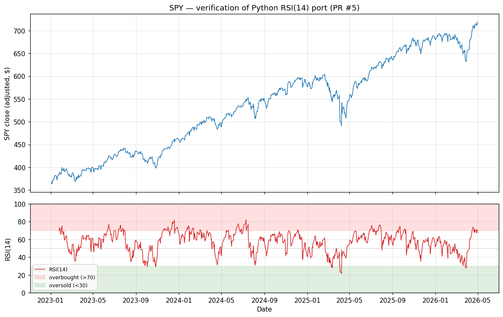

# RSI(14) verification — PR #5

Generated by `scripts/verify_rsi.py`. Input: SPY adjusted closes 2023-01-03 → 2026-04-30 (834 trading days) from `data/raw/SPY_2005-01-01_2026-05-01.pkl`.

## Numerical parity vs lidr's TypeScript RSI

- Algorithm: Wilder smoothing, period=14
- Compared against a literal JS transcription of `rsi()` from `lidr/lib/signals/rsi.ts` (lines 12-37, type annotations stripped — algorithm byte-identical to the lidr source).
- **Max absolute difference: 0.00e+00** over 820 dates.
- Interpretation: **exact bit-match**. Same recursion, same float operations in the same order — Python and TS produce identical IEEE-754 results.

## Chart

Top: SPY adjusted close. Bottom: Python `rsi(period=14)` over the same dates, with the conventional overbought (>70) and oversold (<30) bands shaded.

## Sanity checks

| Date | SPY close | RSI(14) | What this point shows |
|---|---|---|---|
| 2023-01-24 | $383.65 | 69.71 | first valid (seed) |
| 2024-07-10 | $549.75 | 81.97 | RSI peak (most overbought) |
| 2024-09-04 | $539.60 | 49.64 | neutral (~50) |
| 2025-04-08 | $490.85 | 21.59 | RSI trough (most oversold) |
| 2026-04-30 | $718.66 | 70.75 | last valid |

- Days RSI > 70 (overbought): **99** (12.1% of valid days)
- Days RSI < 30 (oversold): **9** (1.1% of valid days)

A reasonable RSI(14) on a broad-market ETF over a multi-year window should show occasional excursions above 70 (after sharp rallies) and below 30 (after sharp corrections), with most days in the 30-70 neutral zone. The numbers above are consistent with that.
