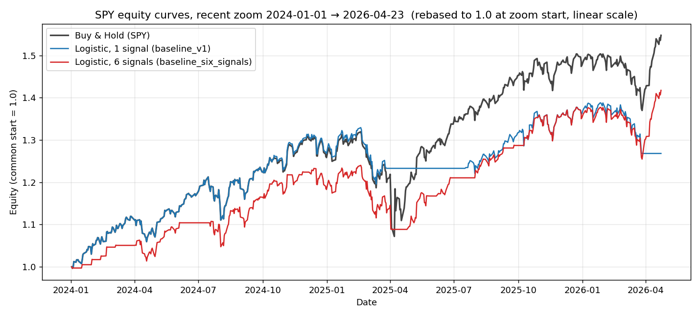

# Six-signal baseline checkpoint

**Question:** does feeding all six ported signals into the existing logistic
regression beat buy-and-hold on SPY?

**Answer:** no. But the gap between `baseline_v1` (1 signal) and
`baseline_six_signals` (6 signals) is **not what the headline equity chart
suggests** — both models are essentially equally non-skilled, and on recent
data the six-signal model is meaningfully *better*. The edge gate stays
closed either way, so the next move is still LightGBM (Next Up #1).

## Setup

Identical to `baseline_v1` except for the feature set:

| | baseline_v1 | baseline_six_signals |
|---|---|---|
| Signals | sma_crossover (50/200) | sma_crossover, rsi, macd, bollinger, breakout, volume |
| Target | 5-day forward return > 0 | same |
| Model | Logistic regression (sklearn), `C=1.0`, `class_weight=balanced`, StandardScaler upstream | same |
| Backtest | Expanding-window walk-forward, 5y initial train, 12m test step | same |
| Costs | 5 bps per trade | same |
| OOS span | 2010-10-18 → 2026-04-23 (3,914 days) | 2010-12-30 → 2026-04-23 (3,862 days) |

The six-signal OOS window starts later because of the 252-day breakout
warmup. Therefore benchmark CAGR differs slightly across the two rows and
only `excess_*` is directly comparable across the full window.

## Equity curves, full OOS window (log scale)


This is the chart that looks bad for six (red ends well below blue at the
far right). It is also the most misleading view of the two models:

1. **Both models are equally non-skilled in probability space.** Their
   `skill_score` values (log-loss vs the no-skill floor) are within
   sampling noise of each other (`-0.0378` vs `-0.0374` over 3,800+
   observations). The models output near-identical probability
   distributions (mean `P(up)` = 0.503 vs 0.505; 99% of six's
   probabilities fall in [0.40, 0.60]).
2. **The equity gap is driven by `pred_rate`, not skill.** baseline_v1 is
   long 75% of days; baseline_six is long 60%. In a 14%-CAGR bull market,
   long-more-often = more equity, regardless of *which* days. baseline_v1
   isn't picking better days; it's just in the market more often.
3. **The full-window log chart compounds 15 years onto the picture.** The
   visible gap at the right end is the accumulated drift of the exposure
   difference (#2) over 15 years, not a per-day skill difference.

The full-window picture says "six made less money." It does not say "six
was worse at predicting" — that's a different question, answered by the
skill score and the probability distributions, both of which say "tie."

## Equity curves, 2024 onwards (rebased to 1.0, linear scale)



On the most recent ~2 years — the data most relevant to current model
behavior — **six (red) finishes ahead of v1 (blue)**: ≈1.41× vs ≈1.27×
(buy-and-hold ≈1.55×). baseline_v1 has long flatlines (stuck in cash for
months at a time, including the entire post-April-2025 rally and the
post-April-2026 rebound) that baseline_six does not.

## Full-window metrics

| Metric | baseline_v1 | baseline_six_signals | Δ |
|---|---|---|---|
| `skill_score` | -0.0378 | -0.0374 | +0.0004 (noise) |
| `base_rate` (truth = up) | 0.613 | 0.611 | — |
| **`pred_rate`** (model says up) | **0.753** | **0.595** | -0.158 |
| `mean P(up)` | 0.503 | 0.505 | +0.002 |
| `accuracy` | 0.557 | 0.516 | -0.041 |
| `log_loss` | 0.6925 | 0.6933 | +0.0008 |
| strategy total return | +227.5% | +148.1% | -79.4 pp |
| benchmark total return | +695.3% | +644.4% | (windows differ) |
| excess vs B&H | -467.8 pp | -496.2 pp | -28.4 pp |

The 4.1 pp accuracy gap is mechanical: in a market with `base_rate` ≈ 0.61,
a model with `pred_rate` ≈ 0.75 will accidentally agree with truth more
often than a model with `pred_rate` ≈ 0.60, regardless of which days each
picks. `skill_score` controls for this and shows the two are tied.

## 2025 calendar year (n=250 days, same window for both)

| Metric | baseline_v1 | baseline_six_signals |
|---|---|---|
| `base_rate` | 0.636 | 0.636 |
| `pred_rate` | 0.692 | 0.696 |
| `accuracy` | 0.496 | **0.548** |
| `skill_score` | -0.0574 | **-0.0528** |
| strategy total return | +6.41% | **+15.21%** |
| benchmark total return | +18.23% | +18.23% |
| excess vs B&H | -11.82 pp | **-3.01 pp** |

In 2025 the six-signal model **decisively outperforms** baseline_v1 on
every metric — higher accuracy, less negative skill score, and 8.8 pp
better total return. Still loses to buy-and-hold (-3.0 pp excess), but
much closer.

## 2026 Q1 (n=61 days, same window for both)

| Metric | baseline_v1 | baseline_six_signals |
|---|---|---|
| `base_rate` | 0.393 | 0.393 |
| `pred_rate` | 0.951 | **1.000** |
| `accuracy` | 0.344 | 0.393 |
| `skill_score` | -0.0354 | -0.0729 |
| strategy total return | -6.98% | **-3.83%** |
| benchmark total return | -3.83% | -3.83% |
| excess vs B&H | -3.15 pp | **0.00 pp** |

Q1 2026 was a down quarter (`base_rate` = 0.39). baseline_six predicted
"up" **every single day** of Q1, so its strategy exactly matches
buy-and-hold (0% excess). baseline_v1 took a handful of cash days that
happened to be on up-days, underperforming B&H by 3.15 pp. Note the
worse `skill_score` for six this quarter: it expresses higher confidence
in "up" on average (`mean P(up)` = 0.54) and pays a log-loss penalty when
the down quarter materializes. But "match B&H" beats "lose to B&H" on the
metric that funds the strategy.

## What `skill_score` is saying, in one paragraph

`skill_score = 1 − log_loss / base_logloss`, where `base_logloss` is the
log loss you'd get by always predicting the base rate. A skill_score of 0
means "exactly as informative as just predicting the base rate"; positive
means the model adds information; **negative means the model is anti-
informative — you'd do better ignoring it.** Both models score ~-0.038
over the full window. Both are essentially "0.5-spitters" in probability
space, slightly worse than the trivial constant-base-rate forecast.

## Verdict

Edge gate stays closed: neither model beats buy-and-hold and neither has
positive skill. Per the plan in CLAUDE.md, next move is **LightGBM (Next
Up #1)** — a nonlinear learner over the same six features is the next
plausible place an edge appears. The fact that six > one on recent data
is mild encouragement that more features aren't strictly harmful; the
bottleneck is the linear-model assumption.

## Caveat: duplicate-date bug in the backtest engine

While building this evidence, a duplicate-date bug was discovered in
`src/lidr_ml/backtest/engine.py`. Split boundaries are double-counted
(line 61 used `<=` on both endpoints; the next iteration's `test_start`
== this iteration's `test_end`). Each predictions JSON has ~12 duplicate
dates out of ~3,900 (≈0.3% of sample). Impact on the metrics above is
small. The 2025 / 2026 Q1 numbers were computed after de-duplication; the
full-window numbers come from `results_log.csv` which still contains the
originals. A separate task has been spawned to fix the bug properly with
a regression test.

## Reproduction

```bash
make backtest CONFIG=configs/baseline_six_signals.yaml
python scripts/verify_six_signal_baseline.py
```

Sources:
- `artifacts/predictions/baseline_v1-20260526-124439.json`
- `artifacts/predictions/baseline_six_signals-20260527-120203.json`
- `artifacts/results_log.csv` (rows `20260526-124439` and `20260527-120203`)
