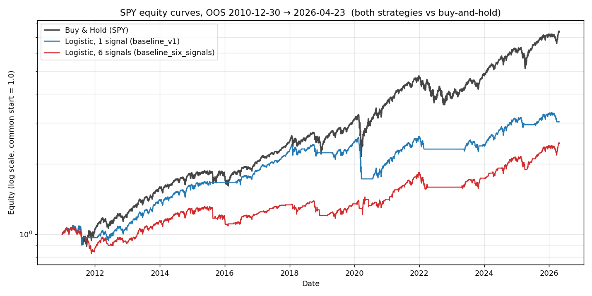

# Six-signal baseline checkpoint

**Question:** does feeding all six ported signals into the existing
logistic regression beat buy-and-hold on SPY?

**Answer:** no. The six-feature model still loses to buy-and-hold by every
metric except max drawdown, and it slightly underperforms even the
single-signal `baseline_v1` floor on equity terms.

## Setup

Identical to `baseline_v1` except for the feature set:

| | baseline_v1 | baseline_six_signals |
|---|---|---|
| Signals | sma_crossover (50/200) | sma_crossover, rsi, macd, bollinger, breakout, volume |
| Target | 5-day forward return > 0 | same |
| Model | Logistic regression, `C=1.0`, `class_weight=balanced` | same |
| Backtest | Expanding-window walk-forward, 5y initial train, 12m test step | same |
| Costs | 5 bps per trade | same |
| OOS span | 2010-10-18 → 2026-04-23 (3,914 days) | 2010-12-30 → 2026-04-23 (3,862 days) |

The six-signal OOS window starts later because of the 252-day breakout warmup.
Benchmark CAGR therefore differs slightly across the two rows; only `excess_*`
is directly comparable.

## Headline comparison

| Metric | baseline_v1 | baseline_six_signals | Delta |
|---|---|---|---|
| skill_score (= 1 − log_loss / base_logloss) | -0.0380 | -0.0376 | +0.0004 (noise) |
| accuracy | 0.556 | 0.515 | -0.041 |
| strategy CAGR | 7.96% | 6.07% | -1.89 pp |
| strategy Sharpe | 0.666 | 0.582 | -0.08 |
| strategy max drawdown | -33.7% | -22.9% | +10.8 pp (shallower) |
| strategy final equity | 3.28x | 2.47x | -0.81x |
| benchmark final equity | 8.23x | 7.43x | (windows differ) |
| excess CAGR vs B&H | -6.6% | -7.9% | -1.3 pp |

The one bright spot is max drawdown: the six-feature model is in cash more
often during deep selloffs (-22.9% vs the benchmark's -33.7%). This is not
edge, but it is directional information.

## Equity curves (aligned to the six-signal OOS window, both rebased to 1.0)



- Buy & Hold (SPY): 7.43x
- Logistic, 1 signal: 3.03x
- Logistic, 6 signals: 2.47x

## Verdict

Edge gate stays closed. Per the plan in CLAUDE.md, next move is LightGBM
(Next Up #1) — a nonlinear learner over the same six features is the next
plausible place an edge appears. Items past the edge gate (final-model fit,
calibration, 3-class migration, artifact schema, lidr wiring) stay parked.

## Reproduction

```bash
make backtest CONFIG=configs/baseline_six_signals.yaml
python scripts/verify_six_signal_baseline.py
```

Sources:
- `baseline_v1-20260526-124439.json`
- `baseline_six_signals-20260527-120203.json`
- `artifacts/results_log.csv` (rows `20260526-124439` and `20260527-120203`)
