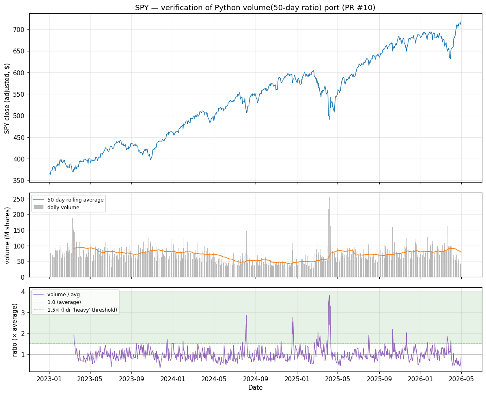

# Volume verification — PR #10

Generated by `scripts/verify_volume.py`. Input: SPY adjusted volume 2023-01-03 → 2026-04-30 (834 trading days) from `data/raw/SPY_2005-01-01_2026-05-01.pkl`.

## Numerical parity vs lidr's TypeScript volume signal

- Parameters: period=50 (lidr's `long` context — `volumeAvgDays`).
- Compared against a literal JS transcription of the rolling-mean and ratio logic from `lidr/lib/signals/volume.ts` (type annotations stripped — algorithm byte-identical to the lidr source).
- **Max absolute difference: 0.00e+00** over 785 dates.
- Interpretation: **exact bit-match**. Same arithmetic, same float operations — Python and TS produce identical IEEE-754 results.

## Chart

Top: SPY adjusted close (for context — the volume signal doesn't use price). Middle: daily traded volume (grey bars) with the 50-day rolling average overlaid (orange). Bottom: the ratio Python emits as the ML feature — today's volume divided by its 50-day average. The dashed green line marks the 1.5× threshold lidr uses to call volume "heavy"; the shaded green region above it is the heavy-volume regime.

## Sanity checks

| Date | SPY close | Today vol (M) | 50-day avg vol (M) | Ratio | What this point shows |
|---|---|---|---|---|---|
| 2023-03-15 | $373.18 | 173.0 | 89.8 | 1.926 | first day above 1.5× (lidr 'heavy volume') |
| 2023-11-24 | $441.32 | 29.7 | 84.9 | 0.350 | ratio trough — quietest day vs recent average |
| 2025-04-07 | $498.66 | 256.6 | 67.1 | 3.822 | ratio peak — biggest volume spike vs recent average |
| 2026-03-31 | $650.34 | 152.5 | 92.2 | 1.655 | most recent day above 1.5× |
| 2026-04-30 | $718.66 | 67.2 | 79.4 | 0.847 | last valid (end of window) |

- Days with heavy volume (ratio ≥ 1.5): **44** (5.6% of valid days)
- Days near average volume (0.8× to 1.2×): **406** (51.7% of valid days)
- Quiet days (ratio < 0.5): **10** (1.3% of valid days)

The ratio is bounded below by zero (no negative volume) and unbounded above; the distribution is naturally right-skewed because volume spikes around news/earnings/macro events have no upper limit but quiet days bottom out near today's volume itself. A well-behaved volume series should cluster around 1.0 with occasional excursions to 1.5×+.
