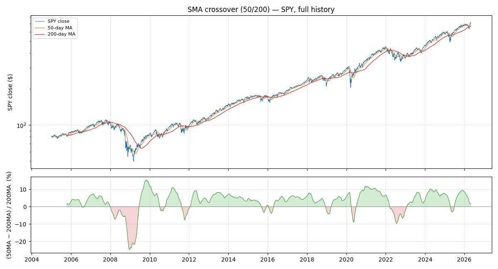
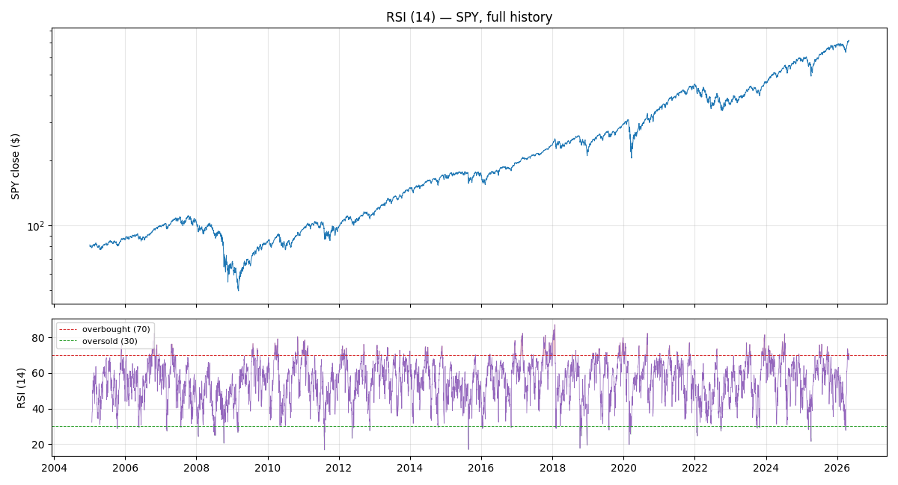
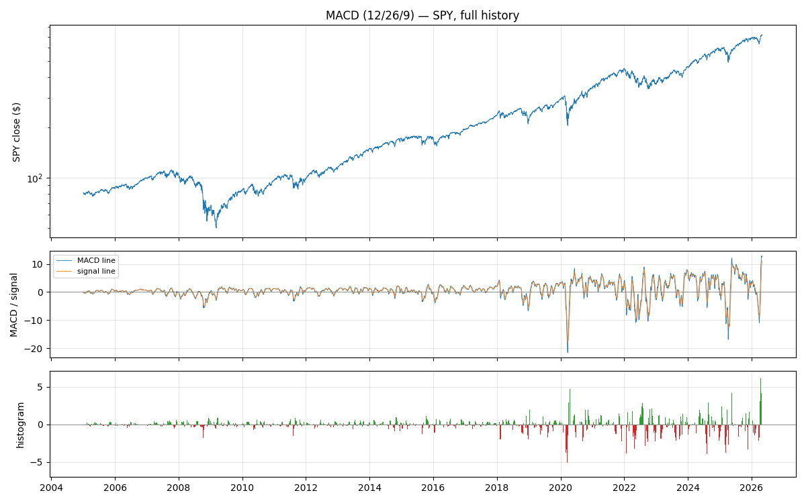
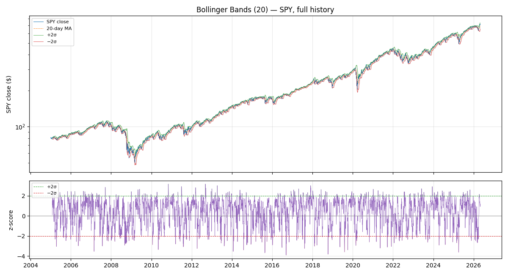
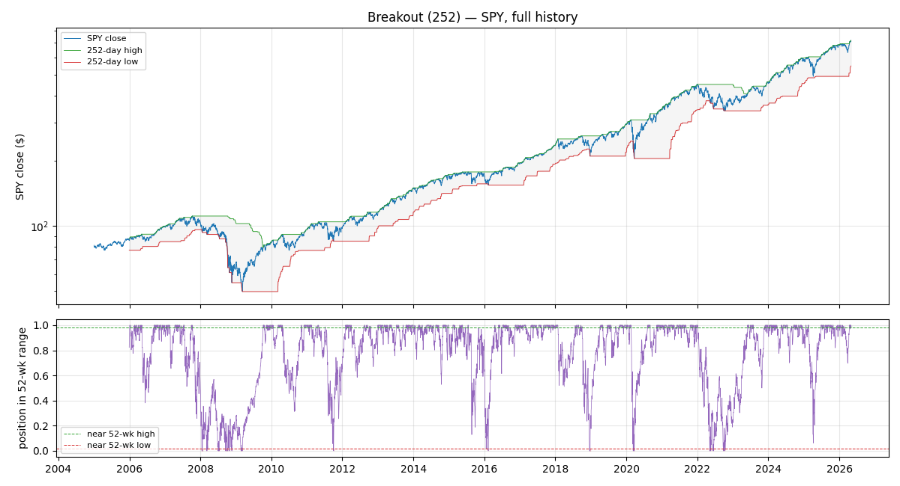
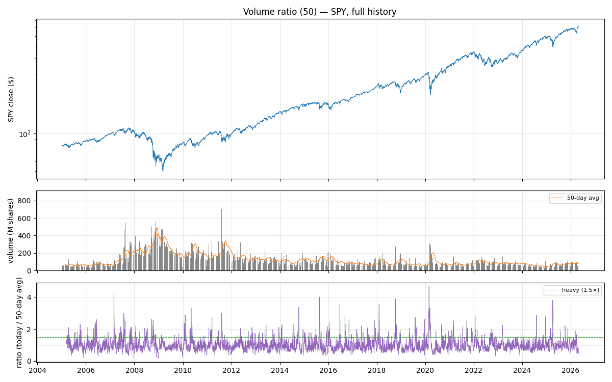

# Signals

This document explains the technical signals the pipeline computes from price and
volume data — what each one measures, why it exists, what it looks like on real
SPY data, and when it tends to help vs. mislead. For how signals plug into the
rest of the pipeline (config files, backtesting, model training), see the
top-level [README](../README.md).

---

## Table of contents

- [What is a "signal" in this project?](#what-is-a-signal-in-this-project)
- [Why each signal emits a number, not a "BUY" or "SELL"](#why-each-signal-emits-a-number-not-a-buy-or-sell)
- [1. SMA crossover — *is the recent trend above the long-term trend?*](#1-sma-crossover--is-the-recent-trend-above-the-long-term-trend)
- [2. RSI — *how stretched is recent up-day vs down-day pressure?*](#2-rsi--how-stretched-is-recent-up-day-vs-down-day-pressure)
- [3. MACD — *is momentum itself accelerating or decelerating?*](#3-macd--is-momentum-itself-accelerating-or-decelerating)
- [4. Bollinger Bands — *how many standard deviations is price from its mean?*](#4-bollinger-bands--how-many-standard-deviations-is-price-from-its-mean)
- [5. Breakout — *where does today sit inside the 52-week range?*](#5-breakout--where-does-today-sit-inside-the-52-week-range)
- [6. Volume ratio — *how heavy is today's trading vs. recent days?*](#6-volume-ratio--how-heavy-is-todays-trading-vs-recent-days)
- [Cross-signal sanity check: the April 2025 SPY plunge](#cross-signal-sanity-check-the-april-2025-spy-plunge)

---

## What is a "signal" in this project?

A **signal** is a function that turns a price (and sometimes volume) history into a
single number per day. Each number summarises *one* property of recent market
behaviour — the trend, the momentum, how unusual today's price is, how busy trading
has been, etc.

A model later combines several signals into a calibrated probability that next
week's return will be positive. Each signal on its own is weak; the bet is that a
combination is stronger than any one piece.

Every signal in this project has three non-negotiable properties:

1. **It is a pure function of price/volume up to time *t*** — given the same
   history, it always produces the same number. No randomness, no state.
2. **It is lookahead-safe** — the value at time *t* only depends on data at or
   before *t*. A signal that "knew the future" would look brilliant in a backtest
   and fail in production; the test suite enforces this for every signal.
3. **It emits a continuous number, not a categorical action.** See the next
   section for why.

## Why each signal emits a number, not a "BUY" or "SELL"

Most popular descriptions of technical signals end with a decision rule: *"RSI
below 30 → buy"*, *"price near the 52-week high → buy"*. These are convenient for
humans but throw away information.

This project is training a model whose entire job is to learn how to combine
signals — the model can pick its own thresholds, and it benefits from knowing
*how far* a signal is from its threshold, not just which side it's on. So every
signal here emits the underlying continuous quantity:

| Signal | Conventional rule | What the model sees instead |
|---|---|---|
| SMA crossover | 50-day moving average above 200-day → bullish (golden cross) | The percentage gap between the two averages |
| RSI | RSI below 30 → buy | The RSI value, on a 0–100 scale |
| MACD | MACD line above signal line → bullish | Histogram (MACD − signal), normalised |
| Bollinger Bands | Price more than 2σ above mean → overbought | The z-score itself |
| Breakout | Price within 2% of 52-week high → breakout | Position in the 52-week range, 0–1 |
| Volume | Volume ≥ 1.5× average → heavy | Today's volume ÷ N-day average |

The conventional cutoffs *do* show up on the charts below as dashed lines, because
they're useful for human eyeballing. But they are not baked into the feature the
model receives.

### Which direction means what?

A high feature value doesn't mean the same thing for every signal. The six
signals fall into three groups, and *which group a signal belongs to determines
whether a high reading is bullish or bearish*:

| Family | High values mean | Low values mean | Signals in this family |
|---|---|---|---|
| **Trend-following** | Bullish — conventionally BUY | Bearish — conventionally SELL | SMA crossover, MACD, breakout |
| **Mean-reversion** | Overbought — conventionally SELL | Oversold — conventionally BUY | RSI, Bollinger Bands |
| **Conviction (no direction)** | High conviction in *whatever* today's price move was | Low conviction; signals on this day are less reliable | Volume |

Each signal's section below repeats this in a compact "What the number means"
table so you don't have to flip back here.

---

## 1. SMA crossover — *is the recent trend above the long-term trend?*

### What it watches

**SMA** stands for **Simple Moving Average** — the unweighted mean of the last
*N* daily closing prices.

This signal compares two moving averages: a **fast** one (default 50 days) that
tracks the recent trend, and a **slow** one (default 200 days) that tracks the
long-term trend. When the fast crosses above the slow, the recent direction is
stronger than the long-term direction — the famous "golden cross". When it
crosses below, the "death cross".

This is the oldest and simplest trend-following signal. Decades of finance papers
have studied variants of it; the 50/200 pair is the most widely-watched version
in financial media.

### What the number means

This is a **trend-following** signal — high values are bullish.

| Feature value | Conventional reading |
|---|---|
| **High and positive** (50-day MA above 200-day MA) | Bullish trend — conventionally **stay long / BUY** |
| **Near zero** (the two MAs are close to each other) | Trend is undecided — no clear bias |
| **Low and negative** (50-day MA below 200-day MA) | Bearish trend — conventionally **stay out / SELL** |

### How it's calculated

| Layer | What it is | What it tells you |
|---|---|---|
| 50-day MA | Average of the last 50 closes | Where the recent trend sits |
| 200-day MA | Average of the last 200 closes | Where the long-term trend sits |
| **Feature** | (50-day MA − 200-day MA) ÷ 200-day MA | How far above (or below) the long-term trend the recent trend sits, as a fraction |

Dividing by the slow MA matters: it makes the value comparable across stocks at
different price levels. A 1% gap means the same thing on a $70 stock and a $700
stock; the raw difference does not.

### Chart on SPY

*Top:* SPY's daily close (log scale) with the 50-day (orange) and 200-day (red)
moving averages over 2005–2026.

*Bottom:* the feature, expressed as a percentage. Green means the 50-day is
above the 200-day (bullish regime); red means below (bearish regime).

### What you'd have seen in recent history

- **2008–2009 (Global Financial Crisis)**: the deepest red dip in the entire
  chart. The feature reached about −24% in late 2008 — the 50-day MA was a
  quarter below the 200-day MA, an extreme bearish regime that lasted from late
  2007 through mid-2009.
- **March–May 2020 (COVID crash)**: brief but sharp dip to about −9% before the
  ferocious recovery flipped it back positive within months.
- **2022 bear market**: a sustained red zone reaching about −10% in mid-2022 as
  the Fed's rate-hike cycle pulled SPY down throughout the year.
- **April 2025 plunge**: notably, the feature **stayed positive through the worst
  week** (about +1.2% on the plunge day) and only crossed below zero in mid-May,
  bottoming at −3.2% — about five weeks late. This is the textbook illustration
  of SMA crossover's lag (see "when it works" below).

### When this signal works well, and when it doesn't

**Works well in clean, sustained trends.** During the 2009–2020 bull run, the
feature was solidly positive almost the entire time — you'd have stayed long
through the entire move. During the 2008 crash, it was solidly negative for over
a year — you'd have stayed out. When trends are clear, this signal is hard to
beat.

**Fails in two specific ways:**

1. **Whipsaws in choppy markets.** When SPY trades sideways (e.g., much of
   2015), the 50-day and 200-day cross back and forth as the recent average
   wobbles around the long-term one. A naive trader following each cross would
   buy at the top of each wobble and sell at the bottom — death by a thousand
   small losses.
2. **Late at reversals.** Because both averages are *averages*, the signal
   lags real-time price by weeks or months. The April 2025 plunge happened in
   one week; the feature didn't go negative until five weeks later, by which
   time SPY was already recovering. You'd have sold near the bottom and bought
   back near the top — the worst of both worlds. The same lag hurts at every
   sharp V-shaped reversal (March 2020 COVID being another famous example).

### Parameters used here

- `fast = 50`, `slow = 200`. **Why these numbers?** Convention. The 50-day MA is
  roughly 10 weeks (a "quarter" of trading); the 200-day MA is roughly 10
  months. The pair became standard in financial press, and that visibility makes
  it partly self-reinforcing — every charting tool defaults to it, so traders
  collectively react to it.
- The signal requires `fast < slow`, otherwise it raises `ValueError`.
- The first 199 days of any series are `NaN` (the 200-day average isn't defined
  yet); the model treats `NaN` as missing.

---

## 2. RSI — *how stretched is recent up-day vs down-day pressure?*

### What it watches

**RSI** stands for **Relative Strength Index** — a momentum oscillator invented
by J. Welles Wilder Jr. in 1978.

Over the last 14 trading days, how much of the price movement was *up* vs *down*?
RSI converts that ratio into a single number between 0 and 100:

- **Around 50** — up days and down days roughly balance; no clear momentum bias.
- **Above 70** — the recent run-up has been one-sided. Conventionally called
  "overbought" — the idea is that a stock that's gone up nearly every day for two
  weeks tends to take a breather soon.
- **Below 30** — the recent decline has been one-sided. "Oversold" — possible
  candidate for a bounce.

These thresholds are tradition, not law. RSI = 75 is not a sell signal on its
own; it just describes the stretched-up state.

### What the number means

This is a **mean-reversion** signal — high values are conventionally bearish
(the opposite of trend-following). The reasoning: a stock that's been
overwhelmingly up for two weeks is "due" for a breather.

| Feature value | Conventional reading |
|---|---|
| **High (above 70)** — overbought | Conventionally **SELL** — expect a pullback |
| **Around 50** | No directional bias |
| **Low (below 30)** — oversold | Conventionally **BUY** — expect a bounce |

### How it's calculated

RSI uses **Wilder smoothing**, a flavour of exponential moving average that
weights recent days more heavily than older ones. For a 14-day RSI:

| Step | What it computes |
|---|---|
| 1 | For each day, split the price change into a "gain" (if up) or "loss" (if down) |
| 2 | Average gain and average loss over the first 14 days |
| 3 | Each subsequent day blends the previous average with today's value, putting most weight on the existing average and 1/14 on the new day |
| 4 | RS = avg_gain ÷ avg_loss; RSI = 100 − 100/(1 + RS) |

If there are zero losses in the window (every day in the lookback was up), RSI
is defined as 100.

### Chart on SPY

*Top:* SPY's daily close on log scale, 2005–2026.

*Bottom:* the RSI value. The red dashed line is the conventional "overbought"
threshold at 70; the green dashed line is "oversold" at 30. Shaded regions mark
when RSI has crossed into those zones.

### What you'd have seen in recent history

- **October 2008 (Lehman week)**: RSI plunged below 20 — one of the deepest
  oversold readings in market history, marking peak panic.
- **March 2020 (COVID crash)**: RSI dropped into the low 20s within days as
  SPY lost a third of its value in a month.
- **April 2025 plunge**: RSI bottomed at about 21.6 on April 8 — the deepest
  oversold reading of the post-2022 period.
- **2017 and 2021 bull runs**: RSI sat above 70 for *months* at a time — long
  stretches of "overbought" that turned out to be the middle of strong rallies,
  not the top.

### When this signal works well, and when it doesn't

**Works well in range-bound or mean-reverting markets.** When SPY is oscillating
within a range (e.g., much of 2015 or 2023), RSI dips below 30 near the lows
and pokes above 70 near the highs reliably enough to be useful as a contrarian
input. Mean-reversion strategies built around RSI have a real track record on
individual stocks too, where bounces from oversold are common.

**Fails in two specific ways:**

1. **Strong trending markets keep RSI "stretched" for weeks.** During the 2017
   melt-up, RSI was above 70 for most of the year — anyone shorting on the
   first overbought signal got steamrolled. The phrase "the market can stay
   irrational longer than you can stay solvent" describes this exact failure
   mode.
2. **Falling-knife trades in real crashes.** RSI was below 30 for most of
   October 2008; buying the first oversold signal would have put you long for
   another 30% decline before the actual bottom in March 2009. "Oversold can
   get more oversold" is the corresponding adage.

### Parameters used here

- `period = 14`. **Why this number?** It's the original value from Wilder's
  1978 book *New Concepts in Technical Trading Systems*. He explained it as
  "half a month of trading days" but the choice was largely empirical. Every
  charting tool defaults to 14, which has made it the de facto standard ever
  since.
- The first 14 days of any series are `NaN`.

---

## 3. MACD — *is momentum itself accelerating or decelerating?*

### What it watches

**MACD** stands for **Moving Average Convergence Divergence** — a momentum
indicator developed by Gerald Appel in the late 1970s.

It stacks three layers of smoothing on top of price. The first layer measures
**momentum**; the second is a smoothed version of that momentum; the third —
the part the model sees — is the **difference between the two**, which captures
*whether momentum is accelerating or decelerating*.

That's an unusual property among technical signals. SMA crossover and RSI both
react to *direction*. MACD reacts to *change in direction*, which can flip a few
days earlier than the direction itself.

### What the number means

This is a **trend-following** signal — positive histogram values are bullish.

| Feature value | Conventional reading |
|---|---|
| **Positive (green histogram)** — momentum accelerating up | Bullish — conventionally **BUY** signal |
| **Crossing through zero** — MACD just crossed its signal line | Conventionally a trade trigger; the *direction* of the cross matters |
| **Negative (red histogram)** — momentum accelerating down | Bearish — conventionally **SELL** signal |

### How it's calculated

| Layer | What it is | What it tells you |
|---|---|---|
| Price | SPY's daily close | Where the stock is |
| **MACD line** | 12-day EMA of price − 26-day EMA of price | The gap between short-term and long-term trends — a momentum proxy |
| **Signal line** | 9-day EMA of the MACD line itself | A smoothed, slightly-lagging version of momentum |
| **Histogram** | MACD line − signal line | Whether momentum is *accelerating* (positive) or *decelerating* (negative) |
| **Feature** | Histogram ÷ slow EMA | The histogram, normalised so it's comparable across price levels |

(**EMA** = **Exponential Moving Average**, a moving average that weights recent
days more heavily than older ones.)

When the MACD line crosses **above** its own lagged signal line, momentum has
accelerated faster than its own recent average — the histogram turns positive.
The opposite direction turns it negative.

### Chart on SPY

*Top:* SPY's daily close on log scale, 2005–2026.

*Middle:* the MACD line (blue) and its 9-day signal line (orange). The blue
line is the raw momentum proxy; the orange line is a smoothed, slightly-lagging
version of it. They tend to trace similar shapes, with the blue leading the
orange.

*Bottom:* the histogram (MACD − signal). Green when momentum is accelerating
up; red when accelerating down.

### What you'd have seen in recent history

- **2008–2009**: the histogram printed deep red bars throughout the crisis,
  with the MACD line itself dipping well below −20 — momentum strongly
  negative, momentum-of-momentum strongly bearish.
- **March 2020 (COVID)**: a sharp red histogram spike, then the deepest green
  bars in the entire chart in the immediate recovery — a textbook MACD pattern
  around violent reversals.
- **April 2025 plunge**: the histogram bottomed at about −6.4 on the plunge
  day; the subsequent recovery rally produced the strongest bullish reading
  (+6.5) of the post-COVID era a couple weeks later.
- **Across the whole window**: green and red days are roughly evenly split,
  which is what you'd expect from a quantity that measures change in momentum —
  over time, momentum cycles up and down at roughly equal frequency.

### When this signal works well, and when it doesn't

**Works well at catching trend changes earlier than SMA crossover.** Because
MACD is the *difference* between two short-window EMAs (not full moving
averages), it reacts faster. The histogram often flips green in the first days
of a recovery, before the 50-day MA has even started turning up.

**Fails in two specific ways:**

1. **Whipsaws in sideways markets.** During quiet periods (e.g., the calm
   stretches of 2014 or 2017), the histogram flickers green-red-green-red
   every few days as the MACD line oscillates around its signal. Trading every
   flip would generate dozens of trivial trades for no net direction.
2. **Still lags real-time price.** MACD reacts faster than SMA crossover but
   it's still an averaging-based indicator. By the time the histogram has
   clearly turned green, the recovery may already be several percent old —
   the entry price isn't as good as if you'd called the bottom in real time.

### Parameters used here

- `fast = 12`, `slow = 26`, `signal = 9`. **Why these numbers?** They are
  Gerald Appel's originals from the 1970s. There's no deep theoretical reason
  for the specific values — 12 and 26 are roughly two and four weeks of
  trading days, 9 is roughly two weeks for the signal smoother. Their
  longevity is mostly inertia: they're the defaults in every charting package,
  so they're what everyone watches.
- The first 39 days (`slow + signal + 5 − 1`) are `NaN`. The `+ 5` extra
  buffer gives the EMAs time to decay past the seed bias before the model
  sees them.

---

## 4. Bollinger Bands — *how many standard deviations is price from its mean?*

### What it watches

Named after John Bollinger, who introduced them in the 1980s. Bollinger Bands
wrap the price chart with two volatility-adjusted lines, plotted *N* standard
deviations above and below a moving average. The bands **widen** when
volatility rises and **narrow** when it falls — they adapt to each stock's
character automatically.

The feature the model sees is the **z-score**: a single number that says how
many standard deviations today's price is from its recent average. A z-score
of +2 means today is two standard deviations above its 20-day mean
(statistically high); −2 is the opposite; 0 means right on the mean.

### What the number means

Like RSI, this is a **mean-reversion** signal — high values are conventionally
bearish (the assumption being that statistical extremes pull back toward the
mean).

| Feature value | Conventional reading |
|---|---|
| **High (z above +2)** — price stretched above mean | Overbought — conventionally **SELL** |
| **Near 0** — price near its 20-day mean | No extreme signal |
| **Low (z below −2)** — price stretched below mean | Oversold — conventionally **BUY** |

### How it's calculated

| Layer | What it is | What it tells you |
|---|---|---|
| **Middle band** | 20-day moving average of price | The recent "normal" level |
| **Upper band** | Middle + 2 × standard deviation | Two standard deviations above normal |
| **Lower band** | Middle − 2 × standard deviation | Two standard deviations below normal |
| **Feature (z-score)** | (close − middle) ÷ standard deviation | How many σ's price sits from its 20-day mean |

A z-score of +2 is somewhat rare; +3 is rare; +4 is extremely rare. Same on
the downside. The pipeline uses **population standard deviation** (dividing by
*N*, not *N* − 1) — a small implementation detail but it matters for matching
the sister project's TypeScript implementation exactly.

### Chart on SPY

*Top:* SPY's daily close (log scale) with the 20-day moving average (dashed
orange) and the ±2σ bands (green/red). The grey shaded region between the
bands is the "normal" envelope — price spends most of its time inside.

*Bottom:* the z-score the model sees. Dashed lines mark ±2σ.

### What you'd have seen in recent history

- **About 88% of days** lie inside the ±2σ envelope. Under a perfect
  bell-curve distribution this would be ~95%; financial returns famously have
  *fat tails*, so the actual share is lower — but still well above 90%, so
  the envelope remains a meaningful "usually inside" zone.
- **October 2008**: multiple z-scores below −4 (price more than four standard
  deviations below its 20-day mean) — the kind of reading a normal
  distribution would say happens once every several thousand years. In real
  markets, it happens every few decades during major crises.
- **March 2020**: another cluster of sub-−4 readings during the COVID crash.
- **Early April 2025**: z-score trough of about −3.6 at the SPY plunge — the
  most stretched-down reading since the COVID episode.

### When this signal works well, and when it doesn't

**Works well in mean-reverting / range-bound markets.** When price punches
above the upper band in a quiet, range-bound stock, a pullback is genuinely
likely soon — that's the classic Bollinger trade and it has decades of
documented success on individual mean-reverting names.

**Fails in two specific ways:**

1. **Strong trends "walk the band".** During a powerful uptrend, price can ride
   along the upper band for *weeks* — the rolling mean keeps catching up, so
   even though price keeps making new highs, the z-score keeps printing +2 to
   +3 readings the entire way up. Selling at the first +2σ signal would have
   exited every major bull run several percent early.
2. **Volatility regime changes mislead.** The bands widen *after* volatility
   rises, not before. In a transition from calm to turbulent, the first big
   move "uses up" the calm-period standard deviation as the denominator —
   producing huge z-scores that flag a move as more extreme than it really
   was relative to the new regime.

### Parameters used here

- `period = 20`. **Why this number?** John Bollinger's original recommendation,
  roughly one month of trading days. He chose ±2σ for the bands because, under
  the (idealised) assumption that returns are normally distributed, ~95% of
  days would fall inside — making excursions outside genuinely informative.
  In reality returns aren't normal, but the choice has stuck.
- Population standard deviation (`ddof = 0`).
- The first 19 days are `NaN`. If a 20-day window is perfectly flat (zero
  variance), the z-score is undefined and emitted as `NaN`.

---

## 5. Breakout — *where does today sit inside the 52-week range?*

### What it watches

Stocks that push to a new 52-week high tend to keep climbing for a while —
this is one of the few technical patterns with strong academic support
(sometimes called "momentum" or "trend-following" in the literature). The
opposite is also true: stocks at a new 52-week low tend to keep falling.

The feature is simply: **where is today's price inside the trailing 52-week
range?** 0 means at the year-low; 1 means at the year-high; 0.5 is exactly
halfway.

### What the number means

This is a **trend-following / momentum** signal — high values are bullish. This
is the *opposite* interpretation from Bollinger and RSI, where high values
suggest "stretched, expect reversal." For breakout, the assumption is that
strength begets strength.

| Feature value | Conventional reading |
|---|---|
| **Near 1.0** — at or near the 52-week high | Bullish breakout — conventionally **BUY** |
| **Around 0.5** — middle of the range | No bias |
| **Near 0.0** — at or near the 52-week low | Bearish breakdown — conventionally **SELL / avoid** |

### How it's calculated

| Layer | What it is | What it tells you |
|---|---|---|
| 252-day high | The highest close over the past ~52 trading weeks | The year-high water mark |
| 252-day low | The lowest close over the past ~52 trading weeks | The year-low water mark |
| **Feature** | (close − 252-day low) ÷ (252-day high − 252-day low) | 0 at the year-low, 1 at the year-high, 0.5 at the midpoint |

This is essentially the Williams %R / Stochastic indicator, computed on closes
only, and bounded in [0, 1].

### Chart on SPY

*Top:* SPY's daily close (log scale) with the rolling 252-day high (green)
and 252-day low (red). The grey shaded region between them is the trailing
52-week range — SPY is by definition always inside it.

*Bottom:* the position-in-range feature. The green band marks "near 52-week
high" (≥ 0.98) and the red band marks "near 52-week low" (≤ 0.02).

### What you'd have seen in recent history

- **2008–2009**: the feature was pinned near 0 for over a year as SPY made
  successive 52-week lows during the financial crisis.
- **March 2020 (COVID)**: a sharp drop to 0 within weeks, then a rapid
  recovery — by August 2020 the feature was back near 1.
- **2022 bear market**: a sustained period in the lower half of the range
  throughout the year, with the feature touching 0 multiple times.
- **2023–2024**: a steady climb as SPY tracked along the 52-week-high line
  during the recovery.
- **April 2025 plunge**: a brief dip to about 0.06 — close to but not at the
  52-week low, because SPY's spring-2025 drawdown was sharp but didn't take
  out the prior year's bottom.

### When this signal works well, and when it doesn't

**Works well when momentum persists.** Academic work (notably Jegadeesh and
Titman, 1993) showed that stocks at 52-week highs tend to keep outperforming
for 3–12 months. On long-term-trending names — Apple in the 2010s, NVIDIA
since 2023 — buying near the 52-week high and holding has been a great strategy.

**Fails in two specific ways:**

1. **False breakouts ("traps").** Price punches to a new 52-week high,
   attracts buyers and media coverage, then reverses sharply. The trader who
   bought the breakout is now holding at the top of a quick downmove. Stocks
   that "fail at the high" can fall hard, because the buyers who chased the
   breakout are stuck looking for an exit.
2. **Range-bound stocks generate constant noise.** A stock that oscillates
   between two levels for years will trigger the "near 52-week high" condition
   repeatedly without any meaningful follow-through. Without a regime filter,
   acting on every breakout signal is a recipe for a thousand small losses.

### Parameters used here

- `period = 252`. **Why this number?** It's the average number of trading
  days in a year (≈ 365 × 5/7 minus US holidays). The "52-week high" is the
  standard lookback in financial media, in academic momentum papers, and in
  SEC disclosure rules (companies report it on filings), so 252 trading days
  is the natural choice for the daily-bar version.
- The first 251 days of any series are `NaN` (no 52-week history yet).
- If the entire 252-day window is perfectly flat (zero range), the position is
  undefined and emitted as `NaN` — exceptionally rare in practice.

---

## 6. Volume ratio — *how heavy is today's trading vs. recent days?*

### What it watches

How many shares changed hands today, compared to what's normal for this stock
lately. A ratio above 1.0 means today was busier than average; above ~1.5 is
the textbook "heavy volume" threshold — typically coinciding with news,
earnings, macro events, or just sharp price moves that bring in conviction
buying/selling. Below ~0.5 is unusually quiet — typically half-trading days
(Black Friday, the day before Christmas) or sleepy summer Fridays.

Crucially, this signal **does not look at price**. It's a measure of
*conviction* that complements all the price-based signals. A 2% rally on quiet
volume is a different beast from a 2% rally on triple-the-average volume, and
the model can learn to weigh them differently.

### What the number means

Unlike every other signal in this doc, volume **does not have a directional
reading on its own**. High volume means "today was a high-conviction day" — but
whether that conviction was on the buy side or sell side depends on what price
did, which this signal doesn't see. Volume is best read as a *confirmation*
attached to one of the price-based signals.

| Feature value | Conventional reading |
|---|---|
| **High (above ~1.5×)** — heavy volume | High conviction in today's price move — **direction not implied by volume alone**; confirms whatever the price signals are saying |
| **Around 1.0** — normal volume | Routine trading day |
| **Low (below ~0.5)** — thin volume | Low conviction — moves on a day like this may be unreliable; the breakout signal saying "BUY" on thin volume is weaker than the same signal on heavy volume |

### How it's calculated

| Quantity | What it is |
|---|---|
| Today's volume | Number of shares traded today |
| 50-day rolling average | Mean of the last 50 days' volume (including today) |
| **Feature** | Today's volume ÷ 50-day average |

The output is bounded below by 0 (volume can't be negative) and is unbounded
above — a 4× day is possible, a 6× day is rare but happens. The distribution
is naturally right-skewed.

### Chart on SPY

*Top:* SPY's daily close (log scale), for context — this signal doesn't use
price, but the price chart helps locate volume events in time.

*Middle:* daily traded volume (grey bars) with the 50-day rolling average
(orange).

*Bottom:* the ratio the model sees. The green dashed line marks the 1.5×
"heavy volume" threshold; the shaded region above is the heavy-volume regime.

### What you'd have seen in recent history

- **October 2008**: a cluster of 2×–4× volume days as panic selling drove
  record turnover in SPY during the Lehman/AIG/TARP week.
- **August 2011 (US debt-ceiling crisis / S&P downgrade)**: another cluster
  of very heavy days as the US lost its AAA rating.
- **March 2020 (COVID crash)**: not the biggest absolute volume spike in
  history but a sustained period of heavy-volume days, since the 50-day
  baseline was rising fast and most days were 1.5×–3×.
- **April 7, 2025 (SPY plunge)**: 256.6 million shares vs. a 50-day average
  of 67.1 million — a ratio of about 3.8×, the most extreme conviction-selling
  day of the post-2022 period.

### When this signal works well, and when it doesn't

**Works well as a confirmation signal.** Heavy volume on a breakout suggests
real conviction behind the move — institutions are positioning, not just
retail noise. Light volume on a breakout suggests the opposite (a thin move
that may fade). The most established use of volume in technical analysis is
exactly this: as a "vote count" attached to price moves, not as a standalone
buy/sell trigger.

**Fails in two specific ways:**

1. **High volume alone doesn't tell direction.** A 3× volume day could be
   panic selling or panic buying — without price context it's just "something
   happened." A model can learn to combine the volume ratio with a directional
   signal (breakout, SMA crossover) to recover direction, but the volume
   feature on its own carries no sign.
2. **Mechanical events distort the ratio.** Quarterly index rebalances
   (added/removed names), futures-contract roll days, and quarterly options
   expiration ("quad witching") all produce volume spikes that have nothing
   to do with investor conviction. These show up as 1.5×–2× days in normal
   markets and are noise from the signal's perspective.

### Parameters used here

- `period = 50`. **Why this number?** Convention from the sister project's
  TypeScript implementation, which uses 50 for its "long context" volume
  average. There's nothing magical about 50 — it's roughly two months of
  trading. Conventional volume thresholds (the 1.5× "heavy" line) are calibrated
  against the 50-day average in most charting tools.
- The first 49 days are `NaN`.
- The 50-day window **includes** today — i.e., today's volume is part of its
  own benchmark. The denominator is therefore always positive when defined.

---

## Cross-signal sanity check: the April 2025 SPY plunge

A useful test of any signal is *"do its biggest readings line up with events
that were genuinely big at the time?"* The most extreme single week in recent
SPY history is April 4–8, 2025, when SPY fell from $544 to $490 (about −10%)
on tariff news. Every oscillator-style signal flagged it as its most extreme
reading of the post-2022 period:

| Signal | Most extreme reading in the plunge week | What that means |
|---|---|---|
| RSI(14) | 21.59 on April 8 | Deepest oversold (anything below 30 is conventionally "oversold") |
| Bollinger z-score | −3.61σ on April 4 | Over 3.5 standard deviations below the 20-day mean |
| MACD histogram | −6.36 on April 8 | Deepest bearish momentum-of-momentum |
| Breakout(252) | 0.062 on April 8 | Deepest dip toward the 52-week low |
| Volume ratio(50) | 3.82× on April 7 | Highest-conviction selling day in years |
| **SMA crossover(50/200)** | **still +1.17% on April 8** | **Did not register the plunge** — the 50-day MA was still above the 200-day. The death cross only happened on May 15, five weeks late. |

Five signals built from different mathematical foundations (smoothing,
gain/loss ratios, EMA differences, range position, volume averages)
independently flagged the same week as the most extreme of its kind. The
oscillators are reactive — they see the current week and immediately register
it.

The **SMA crossover** is in a different category. As a long-window trend
indicator, it didn't register the plunge at all that week — it doesn't react
to a single bad week against eleven good ones. By the time the death cross
finally arrived in mid-May, the worst of the drawdown was over.

That contrast is the practical reason a model benefits from multiple signals:
the oscillators catch sudden moves, the trend follower catches sustained
regime shifts. Combining them in a model is the bet that the whole becomes
more reliable than any single piece.

(Whether the model can actually *act* on this and beat buy-and-hold is the
subject of the rest of the project — see the [README](../README.md) for the
current state and roadmap. At time of writing, a six-feature logistic
regression has not yet cleared that bar; a non-linear model is next on the
list.)
